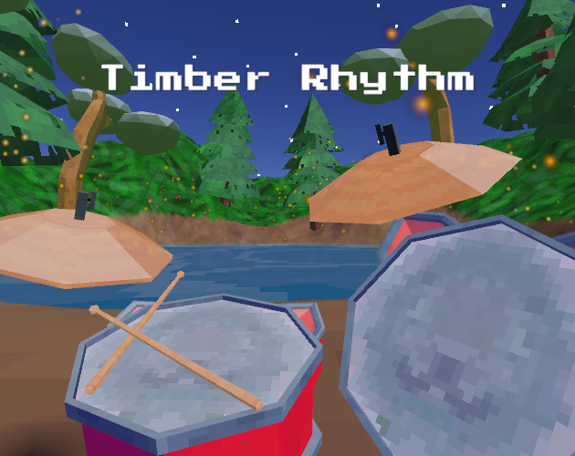
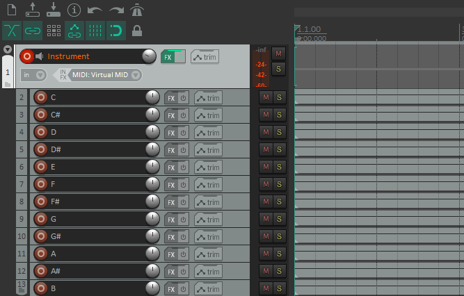
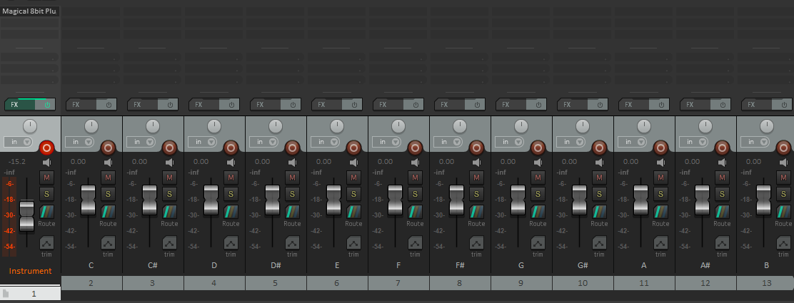

# Timber Rhythm

A retro-inspired music sandbox, for PCVR (SteamVR). Jam out, and let the Loop Machine play it back to you~

This was my submission to "[VRJam 2021](https://itch.io/jam/vr-jam-2021)", a 2.5 day game jam.

    

You can download the game for free here, on [itch.io](https://request.itch.io/timber-rhythm), or you can check out my other projects at [request.moe](https://request.moe).

You're free to do whatever with this code, but if you do use it, it'd be real cool of you to link back to this page or the itch.io page (or both). Thanks!

## Setup

  1. Clone this repo
  2. Install the [SteamVR Plugin](https://assetstore.unity.com/packages/tools/integration/steamvr-plugin-32647), as well as [Hurricane VR](https://assetstore.unity.com/packages/tools/physics/hurricane-vr-physics-interaction-toolkit-177300)

## Some topics of interest in this repo

The main goals going into this project were:

  1. Make something small-scale using Hurricane VR, to get familiar with it. 
  1. Make something that wasn't centered around combat/violence (I needed a break from the genre)
  1. Implement a physics-based drumset (not fully realized)
  1. Implement a loop machine, which would record and repeat played notes. Not unlike a Loop Pedal.

### The Loop Machine: Infrastructure

This is the core of the project. The loop machine can be separated into the following layers:

1. The Loop Machine
	- Responsible for play/pause/stop/record interface.
	- Stores tempo and time signature info
	- Handles the metronome
1. Sections
	- This stores a list of recordings.
	- The idea here would be that the player could record multiple sections (eg: verse, chorus), and switch between them on the fly.
	- Between a lack of time, and space on the UI, I ended up just using one recording section for everything.
1. Recordings
	- This represents a single cycle worth of recorded notes.
	- The recording is responsible for playing all notes that occur between the previous frame, and this frame.
	- Entire recordings can be optionally muted
1. Notes
	- These can be broken down into Impact Notes (one-shot, eg: drum kit), or Sustained Notes (play indefinitely until some stopping condition is met, eg: keyboard key)

### The Loop Machine: Recording and Replaying Notes

The loop machine iterates through a single cycle via time t, in the range [0, 1]. On each frame, we take a look at the time section between the previous frame's t value (pt), and the current t value. For each recording, we play all notes that start between this range of [pt, t]. Stopping sustained notes follows the same logic.

### Recording note samples, and formatting the filenames for ease of use

As of version 1.1.0, there's 180 SFX clips used for sustained notes. That's 12 notes per octave, 3 octaves per keyboard, over 5 keyboard presets. Using Reaper, I generated made a parent track with the VST instrument. Under that track, I added 12 new tracks, each playing a single note of an entire octave. These tracks were all rendered in one export step, each rendering to a separate file.

    
    

From here, I created a script, [formatNoteFileNames.sh](./Assets/SFX/notes/formatNoteFileNames.sh), which would rename these files into something more manageable. The new filenames would include the name of the preset, the octave of the note, an integer from [0, 11] that indicates the note, and the actual name of the note (eg: "triangle-3-0-C.ogg" would be a C3 triangle note).

### Using ScriptableObjects to store Sustained Note references

I created a ScriptableObject ([OctaveNoteCollection](./Assets/ScriptableObjects/OctaveNoteCollection.cs]) to store entire octaves worth of notes, and a second ScriptableObject ([SustainedNoteSoundLibrary](./Assets/ScriptableObjects/SustainedNoteSoundLibrary.cs)) to store a list of octaves (as well as some metadata about the instrument. At this point, each note would only need a reference to the sound library, the octave index, and the name of the note. 

Between this, and the above SFX generation strategy, creating new keyboard presets was very quick.

### Note VFX Events

Each time a note is played (either manually, or from the Loop Machine), an EventChannel is alerted via a UnityAction. Each instrument has a separate event channel. Certain components in the scene can listen to an event channel, and will play some VFX in response (eg: adding ripples to the pond, adding opacity to the pond's fireflies, etc). 

### UI, and Physics Buttons

The buttons were made using Hurricane VR's HVRPhysicsButton script. These were very much plug-and-play, and super easy to use. The only problem I ran into, was that the player can push the buttons from the wrong direction (ie: from the back towards the player), which would still activate the button. I think that childing these Physics Buttons onto a floating rigidbody with no collision is a bit of an edge case, so it makes sense that there's no logic to test the direction of the button press.

## Next Steps 

### Better Drums 

The gold standard that I was aiming for with the drums in my game was to have the drumsticks bounce off of the drum, based on the velocity of the collision. This would make rolls and drags possible. This is something that I briefly tested a while ago, via adding torque to the drum stick's rigidbody on collision, but I ended up not having the time for it. I believe it may not be possible with the base Hurricane VR prefab, but it may be possible with the HurricaneVR + Hexabody prefab, due to how the physics hands are implemented. This is something that I need more testing on to confirm - I believe I tested this concept using the HurricaneVR+Hexabody rig, 

### Better recording

It's pretty easy to mess up the timing of your notes. I'd like to implement some note-snapping functionality, where the note's start time t value gets rounded to the nearest quarter/eighth note's time t value.

It'd also be nice to be able to solo certain recordings. This was also cut due to a lack of time and UI space.

### Section Swapping

Currently, everything is recorded and played via a single section. The infrastructure to play/record with other sections is functional, but it needs to be hooked up to the UI. This was another thing cut due to a lack of UI space. Maybe I need to add tabs to the loop machine?

It'd be nice for the player to be able to queue up a section, so that it plays after the current cycle. This way, there's a smooth transition from the current section to the next. Maybe the player could drag/drop sections into some slot to make this happen?
